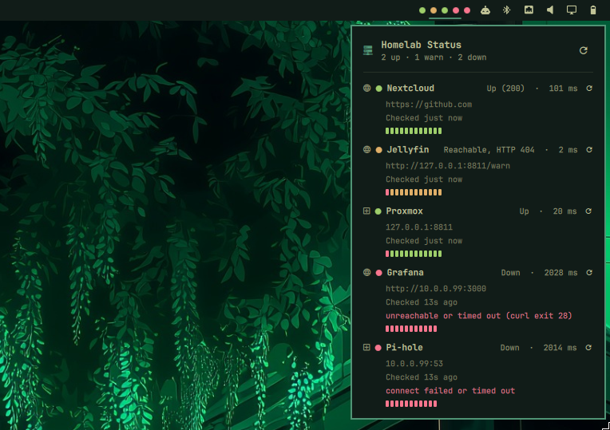

# Homelab Status



At-a-glance colored status dots for your self-hosted services, right in the
bar — one dot per service. An [Omarchy](https://omarchy.org/) (Quattro/v4+)
shell plugin, polling each service over HTTP, TCP, or Docker from this
machine, no per-host agent required.

- **Green** — up (HTTP 2xx, TCP connect succeeded, or a Docker container
  reported healthy/running)
- **Yellow** — reachable, but degraded: a non-2xx HTTP response, or a
  container that's `unhealthy`/still starting its healthcheck
- **Red** — timeout, connection error, or a container that's stopped/missing

Hover a dot for the service name, status, and last latency; click to open a
small popup listing every configured service. A dot flipping color also
fires an Omarchy desktop notification — see [Notifications](#notifications).

## How it works

- Polling happens **from this machine** — no agent, no per-host install.
  Every check shells out via [Quickshell's `Process`](https://quickshell.org/),
  never QML `XMLHttpRequest`: `curl` for HTTP, a plain `bash` TCP socket
  check for TCP, or `ssh` + `docker inspect` for Docker (key-based auth
  only — see [Docker-aware checks](#docker-aware-checks)).
- Two plugin kinds, one manifest: a headless `service` that polls and holds
  state, and a `bar-widget` that only renders — the widget never blocks on a
  network check.
- Checks run through a small worker pool (`maxConcurrent`, default 4) so one
  slow or dead host only ever occupies one slot, never stalls the batch. Each
  check is hard-bounded to ~2s (`timeout`-wrapped, so a stuck DNS lookup
  can't hold a slot open either).
- Dot colors come from the *active Omarchy theme's* `colors.toml`
  (`red`/`green`/`yellow`, or `color1`/`color2`/`color3`), not a hardcoded
  palette, so they adapt automatically when you switch themes.

## Install

```bash
omarchy plugin add https://github.com/ogrt/omarchy-homelab-status.git --enable --yes
```

Or by hand:

```bash
git clone https://github.com/ogrt/omarchy-homelab-status.git \
  ~/.config/omarchy/plugins/ogibon.homelab
omarchy-shell shell rescanPlugins
omarchy plugin enable ogibon.homelab
```

## Remove

```bash
omarchy plugin remove ogibon.homelab
```

This deletes `~/.config/omarchy/plugins/ogibon.homelab/` (your git checkout,
including any real `config.json` you created there) and drops the widget
from your bar layout. Nothing outside that directory is touched — no other
files, services, or system config are modified by this plugin.

## Configure

`config.json` holds your real service list and is gitignored on purpose —
your internal hostnames/IPs never end up in this (public) repo. Start from
the example and edit it in place, or point `config.json` at wherever you
keep private config (a symlink works fine):

```bash
cd ~/.config/omarchy/plugins/ogibon.homelab
cp config.json.example config.json
$EDITOR config.json
```

It hot-reloads on save, no restart needed. An entry that can't be parsed
(missing name/url/host, bad port, etc.) is skipped rather than failing the
whole file — the popup shows a warning naming which ones and why, so a typo
doesn't silently drop a service with no explanation.

```json
{
  "pollIntervalSec": 15,
  "maxConcurrent": 4,
  "notify": true,
  "services": [
    { "name": "Nextcloud", "url": "https://cloud.local", "type": "http" },
    { "name": "Proxmox",   "host": "10.0.0.5", "port": 8006, "type": "tcp" }
  ]
}
```

A bare array of services also works, using the defaults above:

```json
[
  { "name": "Nextcloud", "url": "https://cloud.local", "type": "http" },
  { "name": "Proxmox",   "host": "10.0.0.5", "port": 8006, "type": "tcp" }
]
```

| Field | Type | Notes |
|---|---|---|
| `name` | string | Shown on hover/click |
| `type` | `"http"` \| `"tcp"` \| `"docker"` | Defaults to `http` |
| `url` | string | Required for `http` |
| `host_header` | string | Optional, `http` only — see below |
| `host`, `port` | string, number | Required for `tcp` |
| `host`, `container` | string, string | Required for `docker` — see below |
| `group` | string | Optional — services sharing a `group` get a header in the popup |
| `intervalSec` | number | Optional, per-service override of `pollIntervalSec`, minimum 3 |
| `warnLatencyMs` | number | Optional, per-service override of the top-level `warnLatencyMs` |
| `pollIntervalSec` | number | Default 15, minimum 3 |
| `maxConcurrent` | number | Default 4, 1–16 |
| `notify` | boolean | Default `true` — desktop notification on status change |
| `warnLatencyMs` | number | Default off — an `http` check slower than this counts as degraded, not just up |
| `compact` | boolean | Default `false` — one worst-status dot in the bar instead of one per service |

### Docker-aware checks

A plain HTTP/TCP check can't tell "container running but failing its own
healthcheck" from "genuinely up" — Immich has hit exactly that. `type:
"docker"` asks Docker directly instead, over SSH:

```json
{ "name": "Immich", "type": "docker", "host": "user@myhost.tailnet-name.ts.net", "container": "immich_server" }
```

- `host` is an **SSH target** (`user@host`), not the container's own network
  address — the check runs `docker inspect` on that box, not against it.
  Omit `host` entirely for a container running on the same machine as the
  shell — the check then runs `docker inspect` directly, no SSH hop or key
  required. (Only *omitting* it means local — an SSH config alias that
  happens to be named `localhost` still goes through SSH as normal.)
- `container` is the container name (or ID) as `docker ps` shows it.
- A remote `host` needs key-based SSH already set up (`ssh -o
  BatchMode=yes <host> true` should succeed with no prompt) — the check
  never handles a password, so without a working key it will just read as
  `down`.
- Status: no `HEALTHCHECK` defined *or* `healthy` → up. `unhealthy` or
  `starting` → warn. Anything else (`exited`, `restarting`, container not
  found) → down.

### Notifications

Any status *change* — not every poll — fires `omarchy notification send`:
critical urgency going down, normal urgency for degraded or recovered. This
goes through Omarchy's own notification daemon, so it respects the active
theme and do-not-disturb, and needs nothing beyond what's already on the
system (no ntfy topic, no external service). The very first check of a
newly-added service never notifies — there's nothing to "change" from yet.
Set `"notify": false` in `config.json` to turn it off entirely, or mute a
single service temporarily with the bell icon next to it in the popup (30
minutes, click again to resume early) — handy mid-maintenance on a box you
already know is flapping.

### Per-service poll interval

Everything polls at `pollIntervalSec` by default. A noisy or low-priority
service can run less often:

```json
{ "name": "Pi-hole", "host": "10.0.0.8", "port": 53, "type": "tcp", "intervalSec": 60 }
```

Each service tracks its own next-due time, so overriding one doesn't affect
any other — no shared cadence to work around.

### Slow-response warning

An `http` check only counts a non-2xx response as degraded by default. Set
`warnLatencyMs` (globally, or per-service to override it) to also flag a
*successful* response that's just slow:

```json
{ "warnLatencyMs": 1500, "services": [ ... ] }
```

A response taking longer than that turns the dot yellow with a "slow
response (N ms)" detail in the popup, same as any other degraded state.

### Grouping services in the popup

Give services a shared `group` and the popup renders a header above the
first one, same order as `config.json`:

```json
{ "name": "Proxmox", "host": "10.0.0.5", "port": 8006, "type": "tcp", "group": "Infra" },
{ "name": "Pi-hole", "host": "10.0.0.8", "port": 53, "type": "tcp", "group": "Infra" }
```

Services without a `group` render with no header, in place.

### Compact bar mode

With `"compact": true`, the bar shows a single dot (worst status across all
services wins) instead of one per service — useful once the list grows past
a handful. Hovering it still summarizes counts ("3 up · 1 down"), and
clicking it opens the same full popup as the normal mode.

### Multiple apps behind one reverse-proxy address

If several services share one address (e.g. a Tailscale node or reverse
proxy that routes by `Host:` header), point `url` at the shared address and
set `host_header` to the name each app actually expects:

```json
{ "name": "Immich",      "url": "https://myhost.tailnet-name.ts.net", "host_header": "immich.local" },
{ "name": "Vaultwarden", "url": "https://myhost.tailnet-name.ts.net", "host_header": "vault.local" }
```

curl still connects to (and, over HTTPS, verifies the certificate against)
the host in `url` — only the `Host:` header sent to the proxy changes.

## Development

```bash
omarchy plugin validate ~/.config/omarchy/plugins/ogibon.homelab
```

Query live state without opening the popup:

```bash
quickshell ipc -p $OMARCHY_PATH/shell call ogibon.homelab status
quickshell ipc -p $OMARCHY_PATH/shell call ogibon.homelab refresh
```

## Changelog

See [CHANGELOG.md](CHANGELOG.md).

## License

MIT
